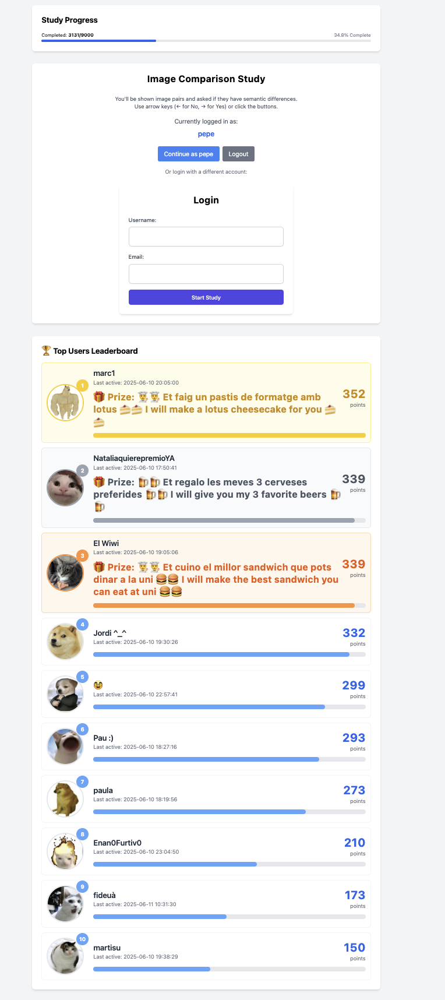
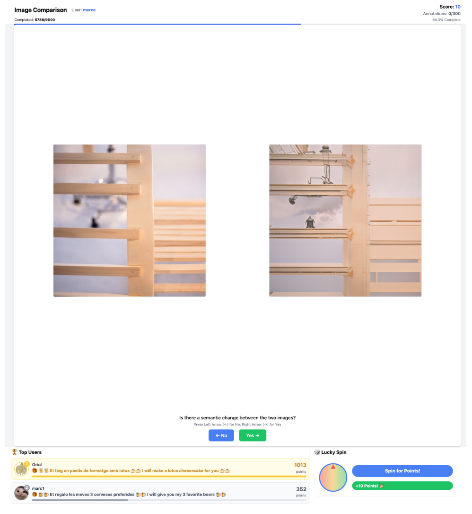
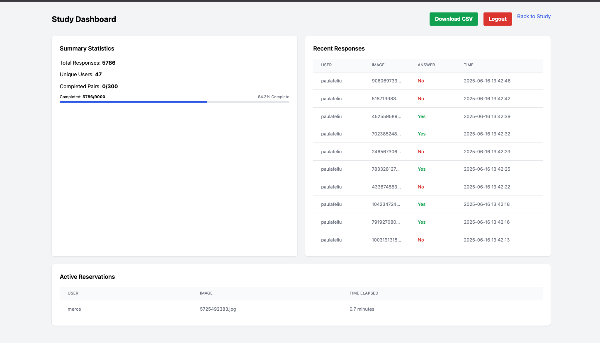

# Need to annotate data? Your friends won't help much because seems boring? 🤔
Say no more to "yes I can help you" and getting 5 images annotated per friend! 🎯 Give them a ranking to compete 🏆, a roulette to play with their points 🎲 and prizes! 🎁

This project has been born from the necessity of having to annotate many images from my final thesis project. 📚
It has been 90% LLM code generated so beware when using it. 🤖 
I have tested it extensivelly but there might be bugs 🐛 and security flaws 🔒. Use at your own risk! ⚠️

# How to use it :)

A web application for conducting image comparison studies, built with Flask. The application allows users to compare pairs of images and indicate whether there are semantic differences between them.

Note! If you are the person and want to do the experiment without compeating with other users in the rankin use a username named "pepe". It is hardcoded hidden from the rankings.

# Home screen
Here are some screenshots of the home screen:

<p align="center">
    
</p>

<p align="center">
    
</p>

<p align="center">
    
</p>

## Requirements

- Python 3.7+
- Flask
- SQLite3
- PyYAML

## Installation

1. Clone the repository:
```bash
git clone https://github.com/yourusername/image-comparison-study.git
cd image-comparison-study
```

2. Create a virtual environment and activate it:
```bash
python -m venv venv
source venv/bin/activate  # On Windows: venv\Scripts\activate
```

3. Install dependencies:
```bash
pip install -r requirements.txt
```

4. Set up the database:
```bash
python app.py
```

5. Configure the application:
- Copy `config.yaml.example` to `config.yaml`
- Update the configuration settings as needed

## Usage

1. Start the application:
```bash
python app.py
```

2. Access the application at `http://localhost:5000`

3. For admin access, use the dashboard password configured in `config.yaml`

## Project Structure

```
.
├── app.py              # Main application file
├── config.yaml         # Configuration file
├── database.db         # SQLite database
├── requirements.txt    # Python dependencies
├── static/            # Static files
│   ├── GT/           # Ground truth images
│   └── SR/           # Super resolution images
└── templates/         # HTML templates
    ├── compare.html
    ├── dashboard.html
    ├── index.html
    └── mobile_compare.html
```

## Configuration

The application can be configured through `config.yaml`:

- Study settings (max responses, timeout, comparison question)
- Dashboard password
- Prize configuration

## Contributing

1. Fork the repository
2. Create a feature branch
3. Commit your changes
4. Push to the branch
5. Create a Pull Request

## License

This project is licensed under the MIT License - see the LICENSE file for details.